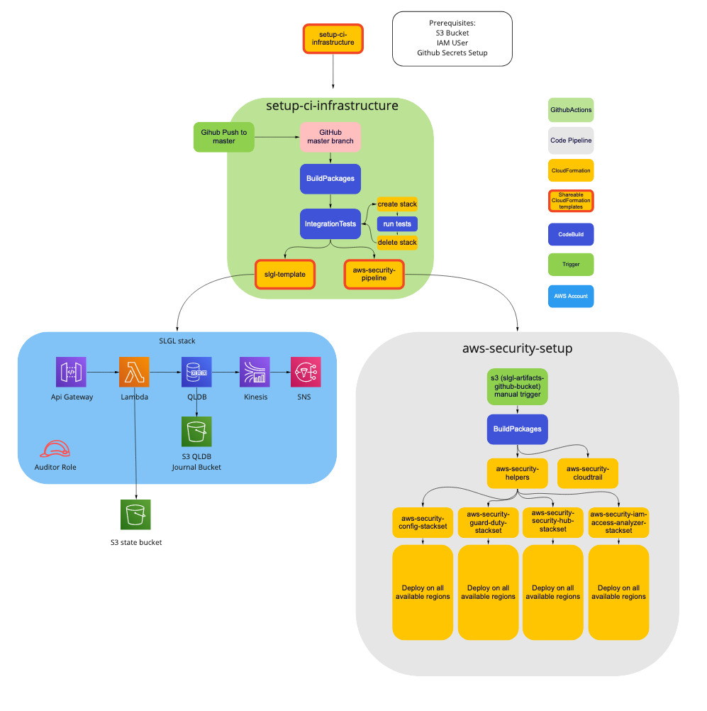
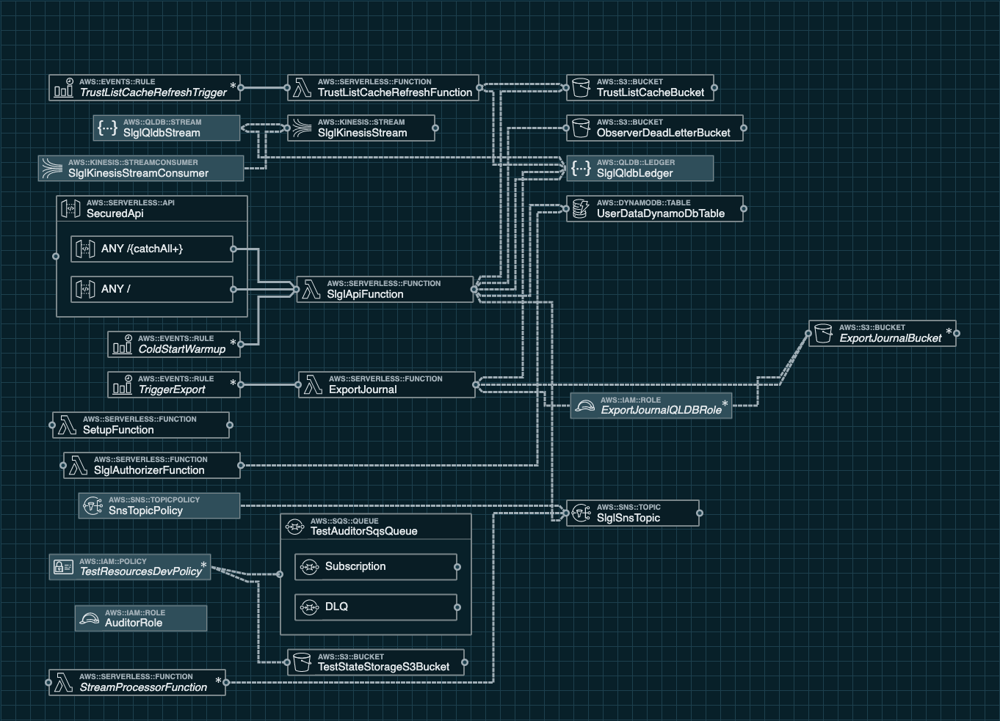

# SLGL Infrastructure

Solution is packed in single CloudFormation template that you can deploy on your AWS account.

* `SLGL` sigle stack to run SLGL yourself

Additionally you may use second CloudFormation template, that secures AWS account in multiple regions:
* `aws-security` contains the resources to secure AWS account in all regions (not required by SLGL itself but highly recommended)

### Getting started
&nbsp;

To get SLGL Stack up and running in your own AWS account, follow these steps (if you do not have an AWS account, please see [How do I create and activate a new Amazon Web Services account?](https://aws.amazon.com/premiumsupport/knowledge-center/create-and-activate-aws-account/)):

1. Log into the [AWS console](https://console.aws.amazon.com/) if you are not already.  
*Note: If you are logged in as an IAM user, ensure your account has permissions to create and manage the necessary resources and components for this application.* 
2. Click on **Launch Stack** button below to open the AWS CloudFormation console and create a new stack. 

 Stack | Launch
 --- | ---
 SLGL | [](https://eu-west-1.console.aws.amazon.com/cloudformation/home?region=eu-west-1#/stacks/create/review?templateURL=https://s3.eu-west-1.amazonaws.com/slgl-artifact-github-bucket/latest/template-export.yml&stackName=slgl) 

3. Continue through the CloudFormation wizard steps
    1. Name your stack, e.g. `slgl`
    2. Decide if you would like to use Stack for developement purpouses (eg run Integrtion Tests on it) and configure parameters accordingly.
    3. After reviewing, check the blue box for creating IAM resources.
4. Choose **Create stack**.  This will take ~10 minutes to complete.
5. Once the CloudFormation deployment is complete, check the status of `slgl` stack. The output of the CloudFormation stack creation will provide a:
    1. `ApiUrl` - API Gateway endpoint URL for for SLGL
    2. `DefaultAdminApiKey` - Randomly generated initial Admin API key (you can to change it via slgl API)  

&nbsp;

#### Update

In order to update stack perform following steps:
1. Go to CloudFormation console
2. Select previously deployed stack and click on `Update` button
3. Select `Replace Current Template` and use s3 url: `https://s3.eu-west-1.amazonaws.com/slgl-artifact-github-bucket/latest/template-export.yml`
4. (Optional) Change stack parameters.


### Secure your AWS account (optional but recommended)

 Stack | Launch
 --- | ---
 aws-security | [](https://eu-west-1.console.aws.amazon.com/cloudformation/home?region=eu-west-1#/stacks/create/review?templateURL=https://s3.eu-west-1.amazonaws.com/slgl-artifact-github-bucket/latest/aws_security_pipeline.yml&stackName=aws-security-slgl) 


### Source code build / deploy

You can build and deploy SLGL directly from source code.

You will need an S3 bucket to store the lambda function code.  Once you've created the bucket,
 run the following CLI commands to create the function stack:

```shell script
sam build
```

```shell script
sam package --s3-bucket *Your S3 bucket* \
    --output-template-file template-export.yml \
    --s3-prefix *Your S3 object prefix*
```

```shell script
sam deploy --template-file template-export.yml \
    --stack-name slgl-dev-stack \
    --capabilities CAPABILITY_IAM \
    --parameter-overrides \
        IncludeIntegrationTestsResources=true \
        IncludeJournalExport=false \
        DevUser=*Your DEV IAM user *
```

CloudFormation will package up the  files, upload them to your S3 bucket, create the lambda function with appropriate permissions and export the all valuable informations in `CloudFormation Outputs`.

## CI/CD Graph



## Detailed SLGL Stack Infrastructure



## IAM Policy Required to deploy SLGL
In order to deploy SLGL you need an IAM User/Role with this permissions:
```json
{
    "Version": "2012-10-17",
    "Statement": [
        {
            "Sid": "cloudtracker",
            "Effect": "Allow",
            "Action": [
                "apigateway:*",
                "cloudformation:createchangeset",
                "cloudformation:deletestack",
                "cloudformation:describechangeset",
                "cloudformation:describestackevents",
                "cloudformation:describestacks",
                "cloudformation:executechangeset",
                "cloudformation:gettemplatesummary",
                "codedeploy:createapplication",
                "codedeploy:createdeploymentgroup",
                "codedeploy:deleteapplication",
                "codedeploy:deletedeploymentgroup",
                "dynamodb:createtable",
                "dynamodb:deletetable",
                "dynamodb:describetable",
                "events:deleterule",
                "events:describerule",
                "events:putrule",
                "events:puttargets",
                "events:removetargets",
                "iam:attachrolepolicy",
                "iam:createrole",
                "iam:deleterole",
                "iam:deleterolepolicy",
                "iam:deleteuserpolicy",
                "iam:detachrolepolicy",
                "iam:getrole",
                "iam:getUserPolicy",
                "iam:PassRole",
                "iam:putrolepolicy",
                "iam:putuserpolicy",
                "kinesis:createstream",
                "kinesis:deletestream",
                "kinesis:deregisterstreamconsumer",
                "kinesis:describestreamconsumer",
                "kinesis:describestreamsummary",
                "kinesis:increasestreamretentionperiod",
                "kinesis:listtagsforstream",
                "kinesis:registerstreamconsumer",
                "kms:creategrant",
                "kms:decrypt",
                "kms:describekey",
                "kms:encrypt",
                "lambda:addpermission",
                "lambda:createalias",
                "lambda:createeventsourcemapping",
                "lambda:createfunction",
                "lambda:deletealias",
                "lambda:deleteeventsourcemapping",
                "lambda:deletefunction",
                "lambda:geteventsourcemapping",
                "lambda:getfunction",
                "lambda:getfunctionconfiguration",
                "lambda:getprovisionedconcurrencyconfig",
                "lambda:listversionsbyfunction",
                "lambda:publishversion",
                "lambda:putprovisionedconcurrencyconfig",
                "lambda:removepermission",
                "lambda:InvokeFunction",
                "lambda:UpdateFunctionCode",
                "lambda:ListTags",
                "qldb:canceljournalkinesisstream",
                "qldb:createledger",
                "qldb:deleteledger",
                "qldb:describejournalkinesisstream",
                "qldb:describeledger",
                "qldb:tagresource",
                "qldb:streamjournaltokinesis",
                "s3:CreateBucket",
                "s3:deletebucket",
                "s3:deletebucketpolicy",
                "s3:putbucketpolicy",
                "s3:PutBucketAcl",
                "sns:createtopic",
                "sns:deletetopic",
                "sns:gettopicattributes",
                "sns:settopicattributes",
                "sqs:createqueue",
                "sqs:deletequeue",
                "sqs:GetQueueAttributes",
                "sts:getcalleridentity"
            ],
            "Resource": [
                "*"
            ]
        }
    ]
}
```


Additionally to run integration tests performed in Github Workflow [`workflow`](.github/workflows/main.yml) you need to assign those permissions to user running tests. 
```json
{
    "Version": "2012-10-17",
    "Statement": [
        {
            "Sid": "UploadArtifatsToS3Bucket",
            "Effect": "Allow",
            "Action": [
                "s3:ListBucketVersions",
                "s3:PutObject",
                "s3:ListBucket",
                "s3:GetObject"
            ],
            "Resource": [
                "arn:aws:s3:::slgl-artifact-github-bucket",
                "arn:aws:s3:::slgl-artifact-github-bucket/*"
            ]
        },
        {
            "Sid": "TestAuditorSQSAccess",
            "Effect": "Allow",
            "Action": [
                "sqs:ReceiveMessage",
                "sqs:DeleteMessage",
                "s3:ListBucket",
                "s3:GetObject"
            ],
            "Resource": [
                "arn:aws:sqs:::*test-auditor-sqs"
            ]
        },
        {
            "Sid": "TestStorageBucketAccess",
            "Effect": "Allow",
            "Action": [
                "s3:ListBucketVersions",
                "s3:ListBucket",
                "s3:PutObject",
                "s3:PutObjectAcl",
                "s3:ListBucket",
                "s3:DeleteObject"
            ],
            "Resource": [
                "arn:aws:s3:::*test-state-storage",
                "arn:aws:s3:::*test-state-storage/*"
            ]
        }
    ]
}
```

## Auditor role

In order to be able to validate all security settings by external parties `slgl` stack contains what we call `Auditor Role`
*You need to specify the AWS account from where that role could be assumed.* 
You may create expiring authenticated links to be able to acccess AWS console, or create temporary STS credentils.
Otherway you will need to either maintain allowed AWS account list, or open this Role for everyone which could expose you to additional costs (eg scanning through CloudWatch Logs by unauthorized parties).

Auditor IAM Policy consists of two:
`arn:aws:iam::aws:policy/SecurityAudit` - AWS managed Security Audit policy
and additionaly:
```json
{
    "Version": "2012-10-17",
    "Statement": [
        {
            "Action": [
                "cloudformation:ListStackResources",
                "lambda:GetFunction",
                "lambda:GetFunctionEventInvokeConfig",
                "cloudwatch:GetMetricData",
                "cloudwatch:GetMetricStatistics",
                "logs:FilterLogEvents",
                "codepipeline:GetPipeline",
                "codepipeline:ListPipelineExecutions",
                "codepipeline:ListActionExecutions",
                "qldb:ListLedgers",
                "lambda:GetAlias",
                "codepipeline:GetPipelineExecution",
                "codebuild:BatchGetProjects",
                "codebuild:BatchGetBuilds",
                "cloudformation:DetectStackDrift"
            ],
            "Resource": "*",
            "Effect": "Allow"
        }
    ]
}
```
